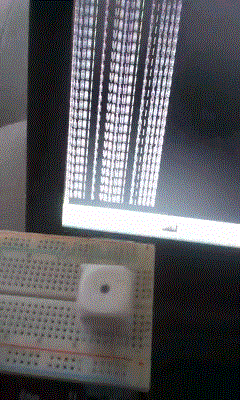

Detect dice number
==================

Script to detect dice current face number with ADXL345 accelerometer.




## Install

 - Enable I2C

``` bash
raspi-config
```

Then enable I2C (in Advanced configuration).

 - Clone this repo

``` bash
git clone git@github.com:alcalyn/dice-rpi.git
cd dice-rpi/
```


## Usage

Uses Python 2.

``` bash
python dice.py
```


## Wiring

ADXL345 is wired like the following:

ADXL345 | RaspberryPi
--------|------------
3.3V    | 3.3V
CS      | 3.3V
GND     | GND
SD0     | GND
SDA     | SDA (GPIO 8)
SCL     | SCL (GPIO 9)

The dice must be oriented orthogonally from ADXL345.

Then the dice should have the "6" face at top when the ADXL345 is at top,
and run the program to know how to place the dice in the other axis.


## License

This library is under [MIT license](LICENSE)
